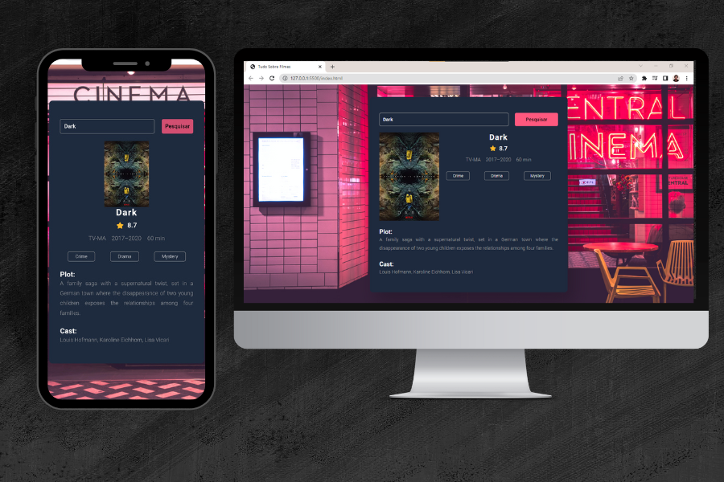

<h1 align="center"> Sinopse de Filmes e Séries </h1>

  <a href="#-tecnologias">Tecnologias</a>&nbsp;&nbsp;&nbsp;|&nbsp;&nbsp;&nbsp;
  <a href="#-projeto">Projeto</a>

  

 

## 🚀 Tecnologias

Esse projeto foi desenvolvido com as seguintes tecnologias:

- HTML
- CSS
- JavaScript
- [OMDb API](https://www.omdbapi.com/)

## 💻 Projeto

O Projeto é um buscador de filmes e séries. No qual traz algumas informações sobre o filme ou séries que foi procurado pelo usuário. Alguns dados como a sua nota, o ano que foi estreado e o tempo de duração.
No desenvolvimento deste projeto foi consumida uma API que traz as informações sobre os conteúdos pesquisados.

---

Feito com ♥ by Alexandre
